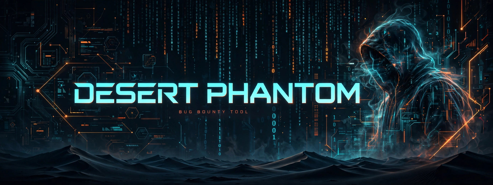

# Desert Phantom V15 ULTIMATE - Bug Bounty Framework

**Author:** mhmd16677 | Tripoli, LY
**Edition:** V15 ULTIMATE - Career Ready
**Status:** For Authorized Testing Only

Professional Bug Bounty automation - The Ultimate Evolution of V10.

### 🔥 Features (V15 ULTIMATE)
- [1/5] Advanced Subdomain Enum (subfinder + crt.sh + anubis + fallback)
- [2/5] Smart Live Filter with Tech Detect (FIXED live.txt + httpx optimization)
- [3/5] Deep Tech Stack Detection (WordPress, Drupal, React/Next.js, Cloudflare, Nginx, Laravel)
- [4/5] Aggressive Port Scan (21,22,80,443,8080,8443,3000,5000,8000,9000) + Service Detection
- [5/5] Vulnerability Scan (Nuclei templates + Secret Finder + JS Analysis) + MD/JSON Reports

### 🚀 Usage
```bash
python3 ultimate.py -d hackerone.com
python3 ultimate.py -d example.com --nuclei
python3 ultimate.py -d example.com -o my_report
